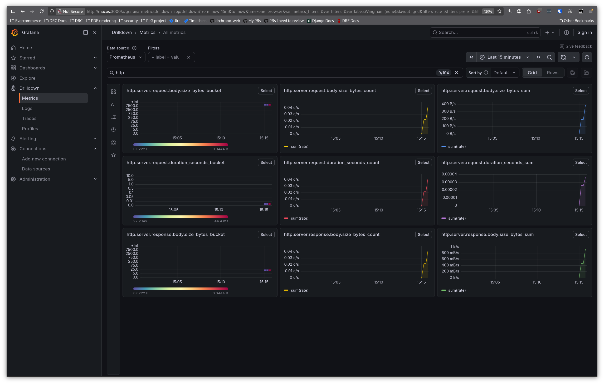
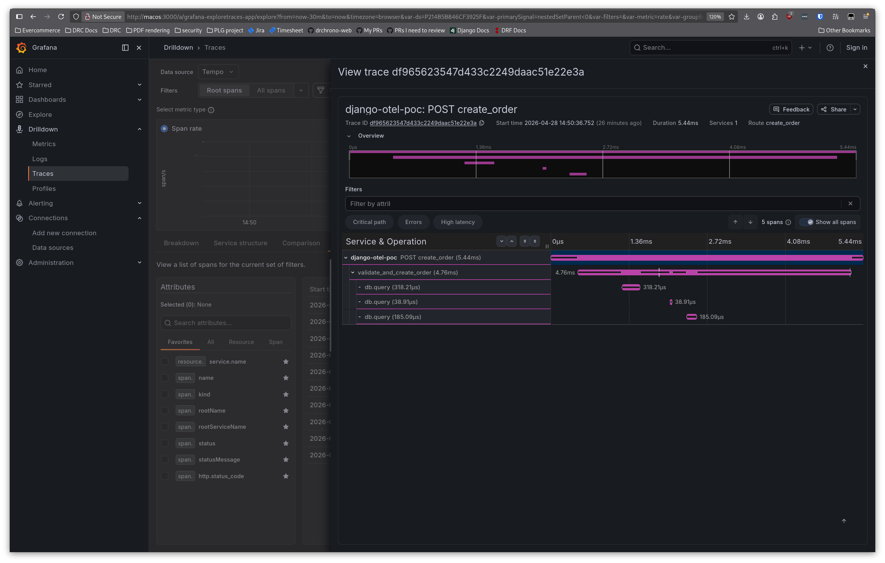

# OpenTelemetry py2.7 Example

OpenTelemetry tracing for a Python 2.7 Django application, with a Grafana observability stack.

This relies on the otel library which was migrated to support python2.7: github.com/drchrono/opentelemetry-python-27

Vibe coded with Opus 4.6

## Quick start

Clone the repo and run a quick e2e test. This makes some API calls and prints the raw trace/metric data:
```bash
git clone --recurse-submodules git@github.com:drchrono/grafana-otel-py2.7.git
cd grafana-otel-py2.7
./e2e.sh
```

You can also access grafana at http://localhost:3000 (login is `admin`/`admin`). Tempo and prometheus should be configured already.

Check out [Drilldown > Traces](http://macos:3000/a/grafana-exploretraces-app/explore?from=now-30m&to=now&timezone=browser&var-ds=P214B5B846CF3925F&var-primarySignal=nestedSetParent%3C0&var-filters=&var-metric=rate&var-groupBy=All&var-spanListColumns=&var-latencyThreshold=&var-partialLatencyThreshold=&var-durationPercentiles=0.9&actionView=traceList) and [Drilldown > Metrics](http://macos:3000/a/grafana-metricsdrilldown-app/drilldown?from=now-1h&to=now&timezone=browser&var-metrics_filters=&var-filters=&var-labelsWingman=%28none%29&layout=grid&filters-rule=&filters-prefix=&filters-suffix=&search_txt=&var-metrics-reducer-sort-by=default&filters-recent=&var-ds=prometheus&var-other_metric_filters=).

You can quickly generate some data with `./generate-spans.sh`, which runs the same API calls as e2e but without the extra fluff.




- App: http://localhost:8000
- Grafana: http://localhost:3000 (admin/admin)
- Tempo: http://localhost:3200
- Prometheus: http://localhost:9090

## Architecture

```
Django (Python 2.7) --[OTLP/JSON HTTP]--> Grafana Alloy --> Grafana Tempo
                                               |
                                               +--> Prometheus
                                                        |
                                          Grafana <-----+
```

- **Django app** -- Python 2.7, Django 1.11, with custom OTel instrumentation (request middleware, DB tracing, manual spans)
- **Grafana Alloy** -- receives OTLP traces, generates span metrics, forwards to Tempo and Prometheus
- **Grafana Tempo** -- distributed trace storage
- **Prometheus** -- stores span metrics (request rate, latency histograms)
- **Grafana** -- dashboards with auto-provisioned Tempo + Prometheus datasources

## OpenTelemetry

The OTel library is sourced from the `opentelemetry-python-27` git submodule (a fork of `opentelemetry-python` backported to Python 2.7). During Docker builds, the API, semantic-conventions, and SDK packages are installed directly from the submodule.

A `sitecustomize.py` polyfill layer provides the Python 3 stdlib features the SDK expects (`time.time_ns`, `functools.lru_cache`, `types.MappingProxyType`, etc.).


### API endpoints

```
GET  /api/products/         -- list products (seeded on first boot)
GET  /api/products/<id>/    -- get a single product
GET  /api/orders/           -- list orders
POST /api/orders/create/    -- create order  {"product_id": ..., "quantity": ..., "notes": "..."}
```

## Project structure

```
app/                          Django application
  instrumentation/            OTel setup, middleware, DB tracing, custom exporter
  api/                        REST views and models
  myproject/                  Django project settings
  sitecustomize.py            Python 2.7 polyfills
config/                       Grafana stack configuration (Alloy, Tempo, Prometheus, Grafana)
opentelemetry-python-27/      OTel Python SDK submodule (Python 2.7 backport)
```
